# 911 Calls Capstone Project

For this capstone project we will be analyzing some 911 call data from [Kaggle](https://www.kaggle.com/mchirico/montcoalert). The data contains the following fields:

* lat : String variable, Latitude
* lng: String variable, Longitude
* desc: String variable, Description of the Emergency Call
* zip: String variable, Zipcode
* title: String variable, Title
* timeStamp: String variable, YYYY-MM-DD HH:MM:SS
* twp: String variable, Township
* addr: String variable, Address
* e: String variable, Dummy variable (always 1)

Just go along with this notebook and try to complete the instructions or answer the questions in bold using your Python and Data Science skills!

## Data and Setup
____
** Import numpy and pandas **


```python
import numpy as np
import pandas as pd
```

** Import visualization libraries and set %matplotlib inline. **


```python
import matplotlib.pyplot as plt 
import seaborn as sns
sns.set_style('whitegrid')
%matplotlib inline
```

** Read in the csv file as a dataframe called df **


```python
df = pd.read_csv('911.csv')
```

** Check the info() of the df **


```python
df.info()
```

    <class 'pandas.core.frame.DataFrame'>
    RangeIndex: 99492 entries, 0 to 99491
    Data columns (total 9 columns):
    lat          99492 non-null float64
    lng          99492 non-null float64
    desc         99492 non-null object
    zip          86637 non-null float64
    title        99492 non-null object
    timeStamp    99492 non-null object
    twp          99449 non-null object
    addr         98973 non-null object
    e            99492 non-null int64
    dtypes: float64(3), int64(1), object(5)
    memory usage: 6.8+ MB


```python
df.info()
```

    <class 'pandas.core.frame.DataFrame'>
    RangeIndex: 99492 entries, 0 to 99491
    Data columns (total 9 columns):
    lat          99492 non-null float64
    lng          99492 non-null float64
    desc         99492 non-null object
    zip          86637 non-null float64
    title        99492 non-null object
    timeStamp    99492 non-null object
    twp          99449 non-null object
    addr         98973 non-null object
    e            99492 non-null int64
    dtypes: float64(3), int64(1), object(5)
    memory usage: 6.8+ MB


** Check the head of df **


```python
df.head()
```


<div>
<style scoped>
    .dataframe tbody tr th:only-of-type {
        vertical-align: middle;
    }

    .dataframe tbody tr th {
        vertical-align: top;
    }

    .dataframe thead th {
        text-align: right;
    }
</style>
<table border="1" class="dataframe">
  <thead>
    <tr style="text-align: right;">
      <th></th>
      <th>lat</th>
      <th>lng</th>
      <th>desc</th>
      <th>zip</th>
      <th>title</th>
      <th>timeStamp</th>
      <th>twp</th>
      <th>addr</th>
      <th>e</th>
    </tr>
  </thead>
  <tbody>
    <tr>
      <th>0</th>
      <td>40.297876</td>
      <td>-75.581294</td>
      <td>REINDEER CT &amp; DEAD END;  NEW HANOVER; Station ...</td>
      <td>19525.0</td>
      <td>EMS: BACK PAINS/INJURY</td>
      <td>2015-12-10 17:40:00</td>
      <td>NEW HANOVER</td>
      <td>REINDEER CT &amp; DEAD END</td>
      <td>1</td>
    </tr>
    <tr>
      <th>1</th>
      <td>40.258061</td>
      <td>-75.264680</td>
      <td>BRIAR PATH &amp; WHITEMARSH LN;  HATFIELD TOWNSHIP...</td>
      <td>19446.0</td>
      <td>EMS: DIABETIC EMERGENCY</td>
      <td>2015-12-10 17:40:00</td>
      <td>HATFIELD TOWNSHIP</td>
      <td>BRIAR PATH &amp; WHITEMARSH LN</td>
      <td>1</td>
    </tr>
    <tr>
      <th>2</th>
      <td>40.121182</td>
      <td>-75.351975</td>
      <td>HAWS AVE; NORRISTOWN; 2015-12-10 @ 14:39:21-St...</td>
      <td>19401.0</td>
      <td>Fire: GAS-ODOR/LEAK</td>
      <td>2015-12-10 17:40:00</td>
      <td>NORRISTOWN</td>
      <td>HAWS AVE</td>
      <td>1</td>
    </tr>
    <tr>
      <th>3</th>
      <td>40.116153</td>
      <td>-75.343513</td>
      <td>AIRY ST &amp; SWEDE ST;  NORRISTOWN; Station 308A;...</td>
      <td>19401.0</td>
      <td>EMS: CARDIAC EMERGENCY</td>
      <td>2015-12-10 17:40:01</td>
      <td>NORRISTOWN</td>
      <td>AIRY ST &amp; SWEDE ST</td>
      <td>1</td>
    </tr>
    <tr>
      <th>4</th>
      <td>40.251492</td>
      <td>-75.603350</td>
      <td>CHERRYWOOD CT &amp; DEAD END;  LOWER POTTSGROVE; S...</td>
      <td>NaN</td>
      <td>EMS: DIZZINESS</td>
      <td>2015-12-10 17:40:01</td>
      <td>LOWER POTTSGROVE</td>
      <td>CHERRYWOOD CT &amp; DEAD END</td>
      <td>1</td>
    </tr>
  </tbody>
</table>
</div>


## Basic Questions

** What are the top 5 zipcodes for 911 calls? **


```python
df['zip'].value_counts().head(5)
```


    19401.0    6979
    19464.0    6643
    19403.0    4854
    19446.0    4748
    19406.0    3174
    Name: zip, dtype: int64


```python
# df['zip'].value_counts().head(5)
```

** What are the top 5 townships (twp) for 911 calls? **


```python
df['twp'].value_counts().head(5)
```


    LOWER MERION    8443
    ABINGTON        5977
    NORRISTOWN      5890
    UPPER MERION    5227
    CHELTENHAM      4575
    Name: twp, dtype: int64


```python
# df['twp'].value_counts().head(5)
```

** Take a look at the 'title' column, how many unique title codes are there? **


```python
df['title'].nunique()
```


    110


```python
# df['title'].nunique()
```

## Creating new features

** In the titles column there are "Reasons/Departments" specified before the title code. These are EMS, Fire, and Traffic. Use .apply() with a custom lambda expression to create a new column called "Reason" that contains this string value.** 

**For example, if the title column value is EMS: BACK PAINS/INJURY , the Reason column value would be EMS. **


```python
df['Reason']= df['title'].apply(lambda title: title.split(':')[0]) 
# keep this technique in mind, it splits wherever it finds the colon .
```


```python
df.head()
```


<div>
<style scoped>
    .dataframe tbody tr th:only-of-type {
        vertical-align: middle;
    }

    .dataframe tbody tr th {
        vertical-align: top;
    }

    .dataframe thead th {
        text-align: right;
    }
</style>
<table border="1" class="dataframe">
  <thead>
    <tr style="text-align: right;">
      <th></th>
      <th>lat</th>
      <th>lng</th>
      <th>desc</th>
      <th>zip</th>
      <th>title</th>
      <th>timeStamp</th>
      <th>twp</th>
      <th>addr</th>
      <th>e</th>
      <th>Reason</th>
    </tr>
  </thead>
  <tbody>
    <tr>
      <th>0</th>
      <td>40.297876</td>
      <td>-75.581294</td>
      <td>REINDEER CT &amp; DEAD END;  NEW HANOVER; Station ...</td>
      <td>19525.0</td>
      <td>EMS: BACK PAINS/INJURY</td>
      <td>2015-12-10 17:40:00</td>
      <td>NEW HANOVER</td>
      <td>REINDEER CT &amp; DEAD END</td>
      <td>1</td>
      <td>EMS</td>
    </tr>
    <tr>
      <th>1</th>
      <td>40.258061</td>
      <td>-75.264680</td>
      <td>BRIAR PATH &amp; WHITEMARSH LN;  HATFIELD TOWNSHIP...</td>
      <td>19446.0</td>
      <td>EMS: DIABETIC EMERGENCY</td>
      <td>2015-12-10 17:40:00</td>
      <td>HATFIELD TOWNSHIP</td>
      <td>BRIAR PATH &amp; WHITEMARSH LN</td>
      <td>1</td>
      <td>EMS</td>
    </tr>
    <tr>
      <th>2</th>
      <td>40.121182</td>
      <td>-75.351975</td>
      <td>HAWS AVE; NORRISTOWN; 2015-12-10 @ 14:39:21-St...</td>
      <td>19401.0</td>
      <td>Fire: GAS-ODOR/LEAK</td>
      <td>2015-12-10 17:40:00</td>
      <td>NORRISTOWN</td>
      <td>HAWS AVE</td>
      <td>1</td>
      <td>Fire</td>
    </tr>
    <tr>
      <th>3</th>
      <td>40.116153</td>
      <td>-75.343513</td>
      <td>AIRY ST &amp; SWEDE ST;  NORRISTOWN; Station 308A;...</td>
      <td>19401.0</td>
      <td>EMS: CARDIAC EMERGENCY</td>
      <td>2015-12-10 17:40:01</td>
      <td>NORRISTOWN</td>
      <td>AIRY ST &amp; SWEDE ST</td>
      <td>1</td>
      <td>EMS</td>
    </tr>
    <tr>
      <th>4</th>
      <td>40.251492</td>
      <td>-75.603350</td>
      <td>CHERRYWOOD CT &amp; DEAD END;  LOWER POTTSGROVE; S...</td>
      <td>NaN</td>
      <td>EMS: DIZZINESS</td>
      <td>2015-12-10 17:40:01</td>
      <td>LOWER POTTSGROVE</td>
      <td>CHERRYWOOD CT &amp; DEAD END</td>
      <td>1</td>
      <td>EMS</td>
    </tr>
  </tbody>
</table>
</div>


** What is the most common Reason for a 911 call based off of this new column? **


```python
df['Reason'].value_counts()
```


    EMS        48877
    Traffic    35695
    Fire       14920
    Name: Reason, dtype: int64


```python
# df['Reason'].value_counts()
```

** Now use seaborn to create a countplot of 911 calls by Reason. **


```python
sns.countplot(x='Reason', data=df, palette='viridis')
```


    <matplotlib.axes._subplots.AxesSubplot at 0x1a18cedbe0>


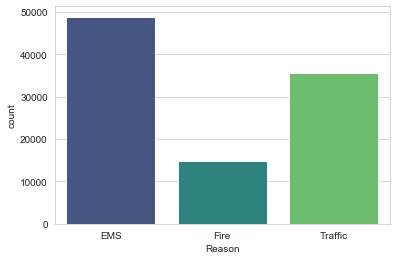


```python
# sns.countplot(x='Reason', data=df)
```

___
** Now let us begin to focus on time information. What is the data type of the objects in the timeStamp column? **


```python
type( df['timeStamp'].iloc[0])
```


    str


** You should have seen that these timestamps are still strings. Use [pd.to_datetime](http://pandas.pydata.org/pandas-docs/stable/generated/pandas.to_datetime.html) to convert the column from strings to DateTime objects. **


```python
df['timeStamp']= pd.to_datetime(df['timeStamp'])
```


```python
df.head()
```


<div>
<style scoped>
    .dataframe tbody tr th:only-of-type {
        vertical-align: middle;
    }

    .dataframe tbody tr th {
        vertical-align: top;
    }

    .dataframe thead th {
        text-align: right;
    }
</style>
<table border="1" class="dataframe">
  <thead>
    <tr style="text-align: right;">
      <th></th>
      <th>lat</th>
      <th>lng</th>
      <th>desc</th>
      <th>zip</th>
      <th>title</th>
      <th>timeStamp</th>
      <th>twp</th>
      <th>addr</th>
      <th>e</th>
      <th>Reason</th>
    </tr>
  </thead>
  <tbody>
    <tr>
      <th>0</th>
      <td>40.297876</td>
      <td>-75.581294</td>
      <td>REINDEER CT &amp; DEAD END;  NEW HANOVER; Station ...</td>
      <td>19525.0</td>
      <td>EMS: BACK PAINS/INJURY</td>
      <td>2015-12-10 17:40:00</td>
      <td>NEW HANOVER</td>
      <td>REINDEER CT &amp; DEAD END</td>
      <td>1</td>
      <td>EMS</td>
    </tr>
    <tr>
      <th>1</th>
      <td>40.258061</td>
      <td>-75.264680</td>
      <td>BRIAR PATH &amp; WHITEMARSH LN;  HATFIELD TOWNSHIP...</td>
      <td>19446.0</td>
      <td>EMS: DIABETIC EMERGENCY</td>
      <td>2015-12-10 17:40:00</td>
      <td>HATFIELD TOWNSHIP</td>
      <td>BRIAR PATH &amp; WHITEMARSH LN</td>
      <td>1</td>
      <td>EMS</td>
    </tr>
    <tr>
      <th>2</th>
      <td>40.121182</td>
      <td>-75.351975</td>
      <td>HAWS AVE; NORRISTOWN; 2015-12-10 @ 14:39:21-St...</td>
      <td>19401.0</td>
      <td>Fire: GAS-ODOR/LEAK</td>
      <td>2015-12-10 17:40:00</td>
      <td>NORRISTOWN</td>
      <td>HAWS AVE</td>
      <td>1</td>
      <td>Fire</td>
    </tr>
    <tr>
      <th>3</th>
      <td>40.116153</td>
      <td>-75.343513</td>
      <td>AIRY ST &amp; SWEDE ST;  NORRISTOWN; Station 308A;...</td>
      <td>19401.0</td>
      <td>EMS: CARDIAC EMERGENCY</td>
      <td>2015-12-10 17:40:01</td>
      <td>NORRISTOWN</td>
      <td>AIRY ST &amp; SWEDE ST</td>
      <td>1</td>
      <td>EMS</td>
    </tr>
    <tr>
      <th>4</th>
      <td>40.251492</td>
      <td>-75.603350</td>
      <td>CHERRYWOOD CT &amp; DEAD END;  LOWER POTTSGROVE; S...</td>
      <td>NaN</td>
      <td>EMS: DIZZINESS</td>
      <td>2015-12-10 17:40:01</td>
      <td>LOWER POTTSGROVE</td>
      <td>CHERRYWOOD CT &amp; DEAD END</td>
      <td>1</td>
      <td>EMS</td>
    </tr>
  </tbody>
</table>
</div>


** You can now grab specific attributes from a Datetime object by calling them. For example:**

    time = df['timeStamp'].iloc[0]
    time.hour

**You can use Jupyter's tab method to explore the various attributes you can call. Now that the timestamp column are actually DateTime objects, use .apply() to create 3 new columns called Hour, Month, and Day of Week. You will create these columns based off of the timeStamp column, reference the solutions if you get stuck on this step.**


```python
df['Hour']= df['timeStamp'].apply(lambda time: time.hour)
df['Month']= df['timeStamp'].apply(lambda time: time.month)
df['Day of Week']= df['timeStamp'].apply(lambda time: time.dayofweek)
```


```python
df.head()
```


<div>
<style scoped>
    .dataframe tbody tr th:only-of-type {
        vertical-align: middle;
    }

    .dataframe tbody tr th {
        vertical-align: top;
    }

    .dataframe thead th {
        text-align: right;
    }
</style>
<table border="1" class="dataframe">
  <thead>
    <tr style="text-align: right;">
      <th></th>
      <th>lat</th>
      <th>lng</th>
      <th>desc</th>
      <th>zip</th>
      <th>title</th>
      <th>timeStamp</th>
      <th>twp</th>
      <th>addr</th>
      <th>e</th>
      <th>Reason</th>
      <th>Hour</th>
      <th>Month</th>
      <th>Day of Week</th>
    </tr>
  </thead>
  <tbody>
    <tr>
      <th>0</th>
      <td>40.297876</td>
      <td>-75.581294</td>
      <td>REINDEER CT &amp; DEAD END;  NEW HANOVER; Station ...</td>
      <td>19525.0</td>
      <td>EMS: BACK PAINS/INJURY</td>
      <td>2015-12-10 17:40:00</td>
      <td>NEW HANOVER</td>
      <td>REINDEER CT &amp; DEAD END</td>
      <td>1</td>
      <td>EMS</td>
      <td>17</td>
      <td>12</td>
      <td>3</td>
    </tr>
    <tr>
      <th>1</th>
      <td>40.258061</td>
      <td>-75.264680</td>
      <td>BRIAR PATH &amp; WHITEMARSH LN;  HATFIELD TOWNSHIP...</td>
      <td>19446.0</td>
      <td>EMS: DIABETIC EMERGENCY</td>
      <td>2015-12-10 17:40:00</td>
      <td>HATFIELD TOWNSHIP</td>
      <td>BRIAR PATH &amp; WHITEMARSH LN</td>
      <td>1</td>
      <td>EMS</td>
      <td>17</td>
      <td>12</td>
      <td>3</td>
    </tr>
    <tr>
      <th>2</th>
      <td>40.121182</td>
      <td>-75.351975</td>
      <td>HAWS AVE; NORRISTOWN; 2015-12-10 @ 14:39:21-St...</td>
      <td>19401.0</td>
      <td>Fire: GAS-ODOR/LEAK</td>
      <td>2015-12-10 17:40:00</td>
      <td>NORRISTOWN</td>
      <td>HAWS AVE</td>
      <td>1</td>
      <td>Fire</td>
      <td>17</td>
      <td>12</td>
      <td>3</td>
    </tr>
    <tr>
      <th>3</th>
      <td>40.116153</td>
      <td>-75.343513</td>
      <td>AIRY ST &amp; SWEDE ST;  NORRISTOWN; Station 308A;...</td>
      <td>19401.0</td>
      <td>EMS: CARDIAC EMERGENCY</td>
      <td>2015-12-10 17:40:01</td>
      <td>NORRISTOWN</td>
      <td>AIRY ST &amp; SWEDE ST</td>
      <td>1</td>
      <td>EMS</td>
      <td>17</td>
      <td>12</td>
      <td>3</td>
    </tr>
    <tr>
      <th>4</th>
      <td>40.251492</td>
      <td>-75.603350</td>
      <td>CHERRYWOOD CT &amp; DEAD END;  LOWER POTTSGROVE; S...</td>
      <td>NaN</td>
      <td>EMS: DIZZINESS</td>
      <td>2015-12-10 17:40:01</td>
      <td>LOWER POTTSGROVE</td>
      <td>CHERRYWOOD CT &amp; DEAD END</td>
      <td>1</td>
      <td>EMS</td>
      <td>17</td>
      <td>12</td>
      <td>3</td>
    </tr>
  </tbody>
</table>
</div>


** Notice how the Day of Week is an integer 0-6. Use the .map() with this dictionary to map the actual string names to the day of the week: **

    dmap = {0:'Mon',1:'Tue',2:'Wed',3:'Thu',4:'Fri',5:'Sat',6:'Sun'}


```python
dmap = {0:'Mon',1:'Tue',2:'Wed',3:'Thu',4:'Fri',5:'Sat',6:'Sun'}
```


```python
df['Day of Week']= df['Day of Week'].map(dmap)
```


```python
df.head()
```


<div>
<style scoped>
    .dataframe tbody tr th:only-of-type {
        vertical-align: middle;
    }

    .dataframe tbody tr th {
        vertical-align: top;
    }

    .dataframe thead th {
        text-align: right;
    }
</style>
<table border="1" class="dataframe">
  <thead>
    <tr style="text-align: right;">
      <th></th>
      <th>lat</th>
      <th>lng</th>
      <th>desc</th>
      <th>zip</th>
      <th>title</th>
      <th>timeStamp</th>
      <th>twp</th>
      <th>addr</th>
      <th>e</th>
      <th>Reason</th>
      <th>Hour</th>
      <th>Month</th>
      <th>Day of Week</th>
    </tr>
  </thead>
  <tbody>
    <tr>
      <th>0</th>
      <td>40.297876</td>
      <td>-75.581294</td>
      <td>REINDEER CT &amp; DEAD END;  NEW HANOVER; Station ...</td>
      <td>19525.0</td>
      <td>EMS: BACK PAINS/INJURY</td>
      <td>2015-12-10 17:40:00</td>
      <td>NEW HANOVER</td>
      <td>REINDEER CT &amp; DEAD END</td>
      <td>1</td>
      <td>EMS</td>
      <td>17</td>
      <td>12</td>
      <td>Thu</td>
    </tr>
    <tr>
      <th>1</th>
      <td>40.258061</td>
      <td>-75.264680</td>
      <td>BRIAR PATH &amp; WHITEMARSH LN;  HATFIELD TOWNSHIP...</td>
      <td>19446.0</td>
      <td>EMS: DIABETIC EMERGENCY</td>
      <td>2015-12-10 17:40:00</td>
      <td>HATFIELD TOWNSHIP</td>
      <td>BRIAR PATH &amp; WHITEMARSH LN</td>
      <td>1</td>
      <td>EMS</td>
      <td>17</td>
      <td>12</td>
      <td>Thu</td>
    </tr>
    <tr>
      <th>2</th>
      <td>40.121182</td>
      <td>-75.351975</td>
      <td>HAWS AVE; NORRISTOWN; 2015-12-10 @ 14:39:21-St...</td>
      <td>19401.0</td>
      <td>Fire: GAS-ODOR/LEAK</td>
      <td>2015-12-10 17:40:00</td>
      <td>NORRISTOWN</td>
      <td>HAWS AVE</td>
      <td>1</td>
      <td>Fire</td>
      <td>17</td>
      <td>12</td>
      <td>Thu</td>
    </tr>
    <tr>
      <th>3</th>
      <td>40.116153</td>
      <td>-75.343513</td>
      <td>AIRY ST &amp; SWEDE ST;  NORRISTOWN; Station 308A;...</td>
      <td>19401.0</td>
      <td>EMS: CARDIAC EMERGENCY</td>
      <td>2015-12-10 17:40:01</td>
      <td>NORRISTOWN</td>
      <td>AIRY ST &amp; SWEDE ST</td>
      <td>1</td>
      <td>EMS</td>
      <td>17</td>
      <td>12</td>
      <td>Thu</td>
    </tr>
    <tr>
      <th>4</th>
      <td>40.251492</td>
      <td>-75.603350</td>
      <td>CHERRYWOOD CT &amp; DEAD END;  LOWER POTTSGROVE; S...</td>
      <td>NaN</td>
      <td>EMS: DIZZINESS</td>
      <td>2015-12-10 17:40:01</td>
      <td>LOWER POTTSGROVE</td>
      <td>CHERRYWOOD CT &amp; DEAD END</td>
      <td>1</td>
      <td>EMS</td>
      <td>17</td>
      <td>12</td>
      <td>Thu</td>
    </tr>
  </tbody>
</table>
</div>


** Now use seaborn to create a countplot of the Day of Week column with the hue based off of the Reason column. **


```python
sns.countplot(x='Day of Week',data=df,hue='Reason',palette='viridis')

# To relocate the legend
plt.legend(bbox_to_anchor=(1.05, 1), loc=2, borderaxespad=0.)
```


    <matplotlib.legend.Legend at 0x1a1967c5c0>


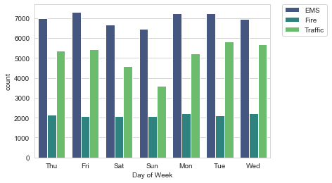


**Now do the same for Month:**


```python
sns.countplot(x='Month',data=df,hue='Reason',palette='viridis')

# To relocate the legend
plt.legend(bbox_to_anchor=(1.05, 1), loc=2, borderaxespad=0.)
```


    <matplotlib.legend.Legend at 0x1a19d861d0>


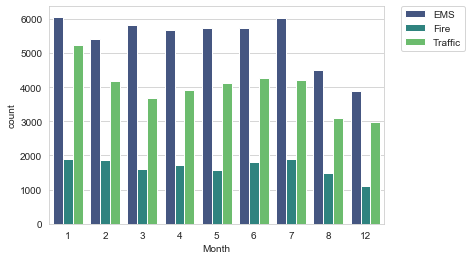


**Did you notice something strange about the Plot?**

_____

** You should have noticed it was missing some Months, let's see if we can maybe fill in this information by plotting the information in another way, possibly a simple line plot that fills in the missing months, in order to do this, we'll need to do some work with pandas... **


```python
# It is missing some months! 9,10, and 11 are not there.
```

** Now create a gropuby object called byMonth, where you group the DataFrame by the month column and use the count() method for aggregation. Use the head() method on this returned DataFrame. **


```python
byMonth = df.groupby('Month').count()
```


```python
byMonth.head()
```


<div>
<style scoped>
    .dataframe tbody tr th:only-of-type {
        vertical-align: middle;
    }

    .dataframe tbody tr th {
        vertical-align: top;
    }

    .dataframe thead th {
        text-align: right;
    }
</style>
<table border="1" class="dataframe">
  <thead>
    <tr style="text-align: right;">
      <th></th>
      <th>lat</th>
      <th>lng</th>
      <th>desc</th>
      <th>zip</th>
      <th>title</th>
      <th>timeStamp</th>
      <th>twp</th>
      <th>addr</th>
      <th>e</th>
      <th>Reason</th>
      <th>Hour</th>
      <th>Day of Week</th>
    </tr>
    <tr>
      <th>Month</th>
      <th></th>
      <th></th>
      <th></th>
      <th></th>
      <th></th>
      <th></th>
      <th></th>
      <th></th>
      <th></th>
      <th></th>
      <th></th>
      <th></th>
    </tr>
  </thead>
  <tbody>
    <tr>
      <th>1</th>
      <td>13205</td>
      <td>13205</td>
      <td>13205</td>
      <td>11527</td>
      <td>13205</td>
      <td>13205</td>
      <td>13203</td>
      <td>13096</td>
      <td>13205</td>
      <td>13205</td>
      <td>13205</td>
      <td>13205</td>
    </tr>
    <tr>
      <th>2</th>
      <td>11467</td>
      <td>11467</td>
      <td>11467</td>
      <td>9930</td>
      <td>11467</td>
      <td>11467</td>
      <td>11465</td>
      <td>11396</td>
      <td>11467</td>
      <td>11467</td>
      <td>11467</td>
      <td>11467</td>
    </tr>
    <tr>
      <th>3</th>
      <td>11101</td>
      <td>11101</td>
      <td>11101</td>
      <td>9755</td>
      <td>11101</td>
      <td>11101</td>
      <td>11092</td>
      <td>11059</td>
      <td>11101</td>
      <td>11101</td>
      <td>11101</td>
      <td>11101</td>
    </tr>
    <tr>
      <th>4</th>
      <td>11326</td>
      <td>11326</td>
      <td>11326</td>
      <td>9895</td>
      <td>11326</td>
      <td>11326</td>
      <td>11323</td>
      <td>11283</td>
      <td>11326</td>
      <td>11326</td>
      <td>11326</td>
      <td>11326</td>
    </tr>
    <tr>
      <th>5</th>
      <td>11423</td>
      <td>11423</td>
      <td>11423</td>
      <td>9946</td>
      <td>11423</td>
      <td>11423</td>
      <td>11420</td>
      <td>11378</td>
      <td>11423</td>
      <td>11423</td>
      <td>11423</td>
      <td>11423</td>
    </tr>
  </tbody>
</table>
</div>


```python
# byMonth = df.groupby('Month').count()
# byMonth.head()
```

** Now create a simple plot off of the dataframe indicating the count of calls per month. **


```python
byMonth['twp'].plot()
```


    <matplotlib.axes._subplots.AxesSubplot at 0x1a19db2c50>


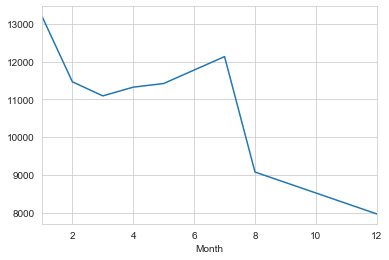


```python
# byMonth['twp'].plot()
```

** Now see if you can use seaborn's lmplot() to create a linear fit on the number of calls per month. Keep in mind you may need to reset the index to a column. **


```python
new_df= byMonth.reset_index()
```


```python
sns.lmplot(x='Month',y='twp', data=new_df)
```


    <seaborn.axisgrid.FacetGrid at 0x1a18dff588>


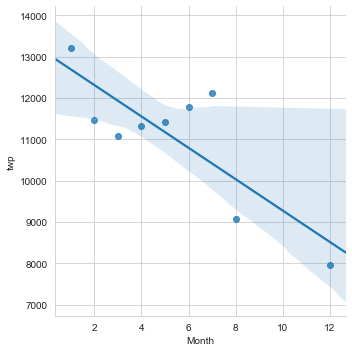


```python
# new_df= byMonth.reset_index()
# sns.lmplot(x='Month',y='twp', data=new_df)
```

**Create a new column called 'Date' that contains the date from the timeStamp column. You'll need to use apply along with the .date() method. ** 


```python
df.head()
```


<div>
<style scoped>
    .dataframe tbody tr th:only-of-type {
        vertical-align: middle;
    }

    .dataframe tbody tr th {
        vertical-align: top;
    }

    .dataframe thead th {
        text-align: right;
    }
</style>
<table border="1" class="dataframe">
  <thead>
    <tr style="text-align: right;">
      <th></th>
      <th>lat</th>
      <th>lng</th>
      <th>desc</th>
      <th>zip</th>
      <th>title</th>
      <th>timeStamp</th>
      <th>twp</th>
      <th>addr</th>
      <th>e</th>
      <th>Reason</th>
      <th>Hour</th>
      <th>Month</th>
      <th>Day of Week</th>
    </tr>
  </thead>
  <tbody>
    <tr>
      <th>0</th>
      <td>40.297876</td>
      <td>-75.581294</td>
      <td>REINDEER CT &amp; DEAD END;  NEW HANOVER; Station ...</td>
      <td>19525.0</td>
      <td>EMS: BACK PAINS/INJURY</td>
      <td>2015-12-10 17:40:00</td>
      <td>NEW HANOVER</td>
      <td>REINDEER CT &amp; DEAD END</td>
      <td>1</td>
      <td>EMS</td>
      <td>17</td>
      <td>12</td>
      <td>Thu</td>
    </tr>
    <tr>
      <th>1</th>
      <td>40.258061</td>
      <td>-75.264680</td>
      <td>BRIAR PATH &amp; WHITEMARSH LN;  HATFIELD TOWNSHIP...</td>
      <td>19446.0</td>
      <td>EMS: DIABETIC EMERGENCY</td>
      <td>2015-12-10 17:40:00</td>
      <td>HATFIELD TOWNSHIP</td>
      <td>BRIAR PATH &amp; WHITEMARSH LN</td>
      <td>1</td>
      <td>EMS</td>
      <td>17</td>
      <td>12</td>
      <td>Thu</td>
    </tr>
    <tr>
      <th>2</th>
      <td>40.121182</td>
      <td>-75.351975</td>
      <td>HAWS AVE; NORRISTOWN; 2015-12-10 @ 14:39:21-St...</td>
      <td>19401.0</td>
      <td>Fire: GAS-ODOR/LEAK</td>
      <td>2015-12-10 17:40:00</td>
      <td>NORRISTOWN</td>
      <td>HAWS AVE</td>
      <td>1</td>
      <td>Fire</td>
      <td>17</td>
      <td>12</td>
      <td>Thu</td>
    </tr>
    <tr>
      <th>3</th>
      <td>40.116153</td>
      <td>-75.343513</td>
      <td>AIRY ST &amp; SWEDE ST;  NORRISTOWN; Station 308A;...</td>
      <td>19401.0</td>
      <td>EMS: CARDIAC EMERGENCY</td>
      <td>2015-12-10 17:40:01</td>
      <td>NORRISTOWN</td>
      <td>AIRY ST &amp; SWEDE ST</td>
      <td>1</td>
      <td>EMS</td>
      <td>17</td>
      <td>12</td>
      <td>Thu</td>
    </tr>
    <tr>
      <th>4</th>
      <td>40.251492</td>
      <td>-75.603350</td>
      <td>CHERRYWOOD CT &amp; DEAD END;  LOWER POTTSGROVE; S...</td>
      <td>NaN</td>
      <td>EMS: DIZZINESS</td>
      <td>2015-12-10 17:40:01</td>
      <td>LOWER POTTSGROVE</td>
      <td>CHERRYWOOD CT &amp; DEAD END</td>
      <td>1</td>
      <td>EMS</td>
      <td>17</td>
      <td>12</td>
      <td>Thu</td>
    </tr>
  </tbody>
</table>
</div>


```python
df['Date']=df['timeStamp'].apply(lambda time: time.date())
df.head()
```


<div>
<style scoped>
    .dataframe tbody tr th:only-of-type {
        vertical-align: middle;
    }

    .dataframe tbody tr th {
        vertical-align: top;
    }

    .dataframe thead th {
        text-align: right;
    }
</style>
<table border="1" class="dataframe">
  <thead>
    <tr style="text-align: right;">
      <th></th>
      <th>lat</th>
      <th>lng</th>
      <th>desc</th>
      <th>zip</th>
      <th>title</th>
      <th>timeStamp</th>
      <th>twp</th>
      <th>addr</th>
      <th>e</th>
      <th>Reason</th>
      <th>Hour</th>
      <th>Month</th>
      <th>Day of Week</th>
      <th>Date</th>
    </tr>
  </thead>
  <tbody>
    <tr>
      <th>0</th>
      <td>40.297876</td>
      <td>-75.581294</td>
      <td>REINDEER CT &amp; DEAD END;  NEW HANOVER; Station ...</td>
      <td>19525.0</td>
      <td>EMS: BACK PAINS/INJURY</td>
      <td>2015-12-10 17:40:00</td>
      <td>NEW HANOVER</td>
      <td>REINDEER CT &amp; DEAD END</td>
      <td>1</td>
      <td>EMS</td>
      <td>17</td>
      <td>12</td>
      <td>Thu</td>
      <td>2015-12-10</td>
    </tr>
    <tr>
      <th>1</th>
      <td>40.258061</td>
      <td>-75.264680</td>
      <td>BRIAR PATH &amp; WHITEMARSH LN;  HATFIELD TOWNSHIP...</td>
      <td>19446.0</td>
      <td>EMS: DIABETIC EMERGENCY</td>
      <td>2015-12-10 17:40:00</td>
      <td>HATFIELD TOWNSHIP</td>
      <td>BRIAR PATH &amp; WHITEMARSH LN</td>
      <td>1</td>
      <td>EMS</td>
      <td>17</td>
      <td>12</td>
      <td>Thu</td>
      <td>2015-12-10</td>
    </tr>
    <tr>
      <th>2</th>
      <td>40.121182</td>
      <td>-75.351975</td>
      <td>HAWS AVE; NORRISTOWN; 2015-12-10 @ 14:39:21-St...</td>
      <td>19401.0</td>
      <td>Fire: GAS-ODOR/LEAK</td>
      <td>2015-12-10 17:40:00</td>
      <td>NORRISTOWN</td>
      <td>HAWS AVE</td>
      <td>1</td>
      <td>Fire</td>
      <td>17</td>
      <td>12</td>
      <td>Thu</td>
      <td>2015-12-10</td>
    </tr>
    <tr>
      <th>3</th>
      <td>40.116153</td>
      <td>-75.343513</td>
      <td>AIRY ST &amp; SWEDE ST;  NORRISTOWN; Station 308A;...</td>
      <td>19401.0</td>
      <td>EMS: CARDIAC EMERGENCY</td>
      <td>2015-12-10 17:40:01</td>
      <td>NORRISTOWN</td>
      <td>AIRY ST &amp; SWEDE ST</td>
      <td>1</td>
      <td>EMS</td>
      <td>17</td>
      <td>12</td>
      <td>Thu</td>
      <td>2015-12-10</td>
    </tr>
    <tr>
      <th>4</th>
      <td>40.251492</td>
      <td>-75.603350</td>
      <td>CHERRYWOOD CT &amp; DEAD END;  LOWER POTTSGROVE; S...</td>
      <td>NaN</td>
      <td>EMS: DIZZINESS</td>
      <td>2015-12-10 17:40:01</td>
      <td>LOWER POTTSGROVE</td>
      <td>CHERRYWOOD CT &amp; DEAD END</td>
      <td>1</td>
      <td>EMS</td>
      <td>17</td>
      <td>12</td>
      <td>Thu</td>
      <td>2015-12-10</td>
    </tr>
  </tbody>
</table>
</div>


```python
# df['Date']=df['timeStamp'].apply(lambda time: time.date())
# df.head()
```

** Now groupby this Date column with the count() aggregate and create a plot of counts of 911 calls.**


```python
D= df.groupby('Date').count()
```


```python
D['twp'].plot()
plt.tight_layout()
```


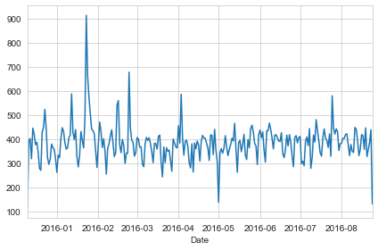


```python
# D= df.groupby('Date').count()
# D['twp'].plot()
```

** Now recreate this plot but create 3 separate plots with each plot representing a Reason for the 911 call**


```python
df[df['Reason']=='Traffic'].groupby('Date').count()['twp'].plot()
plt.tight_layout()
```


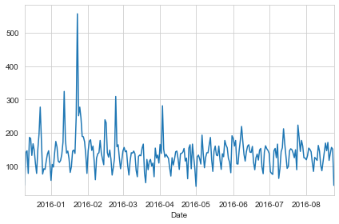


```python
# df[df['Reason']=='Traffic'].groupby('Date').count()['twp'].plot()
```


```python
df[df['Reason']=='Fire'].groupby('Date').count()['twp'].plot()
plt.tight_layout()
```


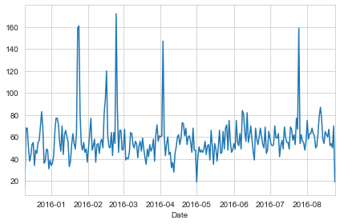


```python
# df[df['Reason']=='Fire'].groupby('Date').count()['twp'].plot()
```


```python
df[df['Reason']=='EMS'].groupby('Date').count()['twp'].plot()
plt.tight_layout()
```


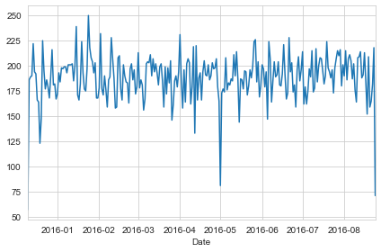


```python
# df[df['Reason']=='Traffic'].groupby('Date').count()['twp'].plot()
```

____
** Now let's move on to creating  heatmaps with seaborn and our data. We'll first need to restructure the dataframe so that the columns become the Hours and the Index becomes the Day of the Week. There are lots of ways to do this, but I would recommend trying to combine groupby with an [unstack](http://pandas.pydata.org/pandas-docs/stable/generated/pandas.DataFrame.unstack.html) method. Reference the solutions if you get stuck on this!**


```python
dayHour= df.groupby(by=['Day of Week', 'Hour']).count()['Reason'].unstack()
dayHour.head()

```


<div>
<style scoped>
    .dataframe tbody tr th:only-of-type {
        vertical-align: middle;
    }

    .dataframe tbody tr th {
        vertical-align: top;
    }

    .dataframe thead th {
        text-align: right;
    }
</style>
<table border="1" class="dataframe">
  <thead>
    <tr style="text-align: right;">
      <th>Hour</th>
      <th>0</th>
      <th>1</th>
      <th>2</th>
      <th>3</th>
      <th>4</th>
      <th>5</th>
      <th>6</th>
      <th>7</th>
      <th>8</th>
      <th>9</th>
      <th>...</th>
      <th>14</th>
      <th>15</th>
      <th>16</th>
      <th>17</th>
      <th>18</th>
      <th>19</th>
      <th>20</th>
      <th>21</th>
      <th>22</th>
      <th>23</th>
    </tr>
    <tr>
      <th>Day of Week</th>
      <th></th>
      <th></th>
      <th></th>
      <th></th>
      <th></th>
      <th></th>
      <th></th>
      <th></th>
      <th></th>
      <th></th>
      <th></th>
      <th></th>
      <th></th>
      <th></th>
      <th></th>
      <th></th>
      <th></th>
      <th></th>
      <th></th>
      <th></th>
      <th></th>
    </tr>
  </thead>
  <tbody>
    <tr>
      <th>Fri</th>
      <td>275</td>
      <td>235</td>
      <td>191</td>
      <td>175</td>
      <td>201</td>
      <td>194</td>
      <td>372</td>
      <td>598</td>
      <td>742</td>
      <td>752</td>
      <td>...</td>
      <td>932</td>
      <td>980</td>
      <td>1039</td>
      <td>980</td>
      <td>820</td>
      <td>696</td>
      <td>667</td>
      <td>559</td>
      <td>514</td>
      <td>474</td>
    </tr>
    <tr>
      <th>Mon</th>
      <td>282</td>
      <td>221</td>
      <td>201</td>
      <td>194</td>
      <td>204</td>
      <td>267</td>
      <td>397</td>
      <td>653</td>
      <td>819</td>
      <td>786</td>
      <td>...</td>
      <td>869</td>
      <td>913</td>
      <td>989</td>
      <td>997</td>
      <td>885</td>
      <td>746</td>
      <td>613</td>
      <td>497</td>
      <td>472</td>
      <td>325</td>
    </tr>
    <tr>
      <th>Sat</th>
      <td>375</td>
      <td>301</td>
      <td>263</td>
      <td>260</td>
      <td>224</td>
      <td>231</td>
      <td>257</td>
      <td>391</td>
      <td>459</td>
      <td>640</td>
      <td>...</td>
      <td>789</td>
      <td>796</td>
      <td>848</td>
      <td>757</td>
      <td>778</td>
      <td>696</td>
      <td>628</td>
      <td>572</td>
      <td>506</td>
      <td>467</td>
    </tr>
    <tr>
      <th>Sun</th>
      <td>383</td>
      <td>306</td>
      <td>286</td>
      <td>268</td>
      <td>242</td>
      <td>240</td>
      <td>300</td>
      <td>402</td>
      <td>483</td>
      <td>620</td>
      <td>...</td>
      <td>684</td>
      <td>691</td>
      <td>663</td>
      <td>714</td>
      <td>670</td>
      <td>655</td>
      <td>537</td>
      <td>461</td>
      <td>415</td>
      <td>330</td>
    </tr>
    <tr>
      <th>Thu</th>
      <td>278</td>
      <td>202</td>
      <td>233</td>
      <td>159</td>
      <td>182</td>
      <td>203</td>
      <td>362</td>
      <td>570</td>
      <td>777</td>
      <td>828</td>
      <td>...</td>
      <td>876</td>
      <td>969</td>
      <td>935</td>
      <td>1013</td>
      <td>810</td>
      <td>698</td>
      <td>617</td>
      <td>553</td>
      <td>424</td>
      <td>354</td>
    </tr>
  </tbody>
</table>
<p>5 rows × 24 columns</p>
</div>


```python
# dayHour= df.groupby(by=['Day of Week', 'Hour']).count()['Reason'].unstack()
# dayHour.head()
```

** Now create a HeatMap using this new DataFrame. **


```python
plt.figure(figsize=(12,6))
sns.heatmap(dayHour,cmap='viridis')
```


    <matplotlib.axes._subplots.AxesSubplot at 0x1a1b353c88>


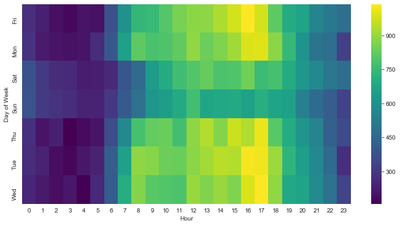


** Now create a clustermap using this DataFrame. **


```python
sns.clustermap(dayHour,cmap='viridis')
```


    <seaborn.matrix.ClusterGrid at 0x1a1b2fa0b8>


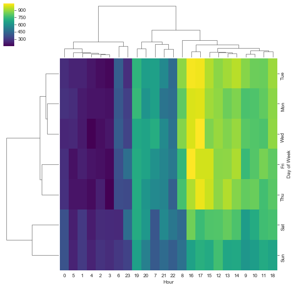


```python
# sns.clustermap(dayHour,cmap='viridis')
```

** Now repeat these same plots and operations, for a DataFrame that shows the Month as the column. **


```python
dayMonth = df.groupby(by=('Day of Week','Month')).count()['Reason'].unstack()
dayMonth.head()
```

    //anaconda3/lib/python3.7/site-packages/ipykernel_launcher.py:1: FutureWarning: Interpreting tuple 'by' as a list of keys, rather than a single key. Use 'by=[...]' instead of 'by=(...)'. In the future, a tuple will always mean a single key.
      """Entry point for launching an IPython kernel.


<div>
<style scoped>
    .dataframe tbody tr th:only-of-type {
        vertical-align: middle;
    }

    .dataframe tbody tr th {
        vertical-align: top;
    }

    .dataframe thead th {
        text-align: right;
    }
</style>
<table border="1" class="dataframe">
  <thead>
    <tr style="text-align: right;">
      <th>Month</th>
      <th>1</th>
      <th>2</th>
      <th>3</th>
      <th>4</th>
      <th>5</th>
      <th>6</th>
      <th>7</th>
      <th>8</th>
      <th>12</th>
    </tr>
    <tr>
      <th>Day of Week</th>
      <th></th>
      <th></th>
      <th></th>
      <th></th>
      <th></th>
      <th></th>
      <th></th>
      <th></th>
      <th></th>
    </tr>
  </thead>
  <tbody>
    <tr>
      <th>Fri</th>
      <td>1970</td>
      <td>1581</td>
      <td>1525</td>
      <td>1958</td>
      <td>1730</td>
      <td>1649</td>
      <td>2045</td>
      <td>1310</td>
      <td>1065</td>
    </tr>
    <tr>
      <th>Mon</th>
      <td>1727</td>
      <td>1964</td>
      <td>1535</td>
      <td>1598</td>
      <td>1779</td>
      <td>1617</td>
      <td>1692</td>
      <td>1511</td>
      <td>1257</td>
    </tr>
    <tr>
      <th>Sat</th>
      <td>2291</td>
      <td>1441</td>
      <td>1266</td>
      <td>1734</td>
      <td>1444</td>
      <td>1388</td>
      <td>1695</td>
      <td>1099</td>
      <td>978</td>
    </tr>
    <tr>
      <th>Sun</th>
      <td>1960</td>
      <td>1229</td>
      <td>1102</td>
      <td>1488</td>
      <td>1424</td>
      <td>1333</td>
      <td>1672</td>
      <td>1021</td>
      <td>907</td>
    </tr>
    <tr>
      <th>Thu</th>
      <td>1584</td>
      <td>1596</td>
      <td>1900</td>
      <td>1601</td>
      <td>1590</td>
      <td>2065</td>
      <td>1646</td>
      <td>1230</td>
      <td>1266</td>
    </tr>
  </tbody>
</table>
</div>


```python
# dayMonth = df.groupby(by=('Day of Week','Month')).count()['Reason'].unstack()
# dayMonth.head()
```


```python
plt.figure(figsize=(12,6))
sns.heatmap(dayMonth,cmap='viridis')
```


    <matplotlib.axes._subplots.AxesSubplot at 0x1a20cbce80>


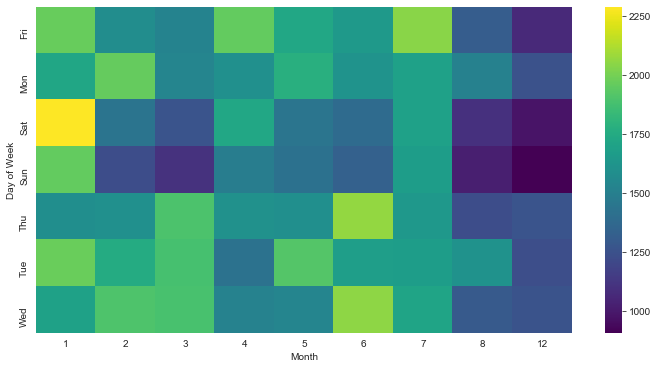


```python
# plt.figure(figsize=(12,6))
# sns.heatmap(dayMonth,cmap='viridis')
```


```python
plt.figure(figsize=(12,6))
sns.clustermap(dayMonth,cmap='viridis')
```


    <seaborn.matrix.ClusterGrid at 0x1a20fc2860>


    <Figure size 864x432 with 0 Axes>


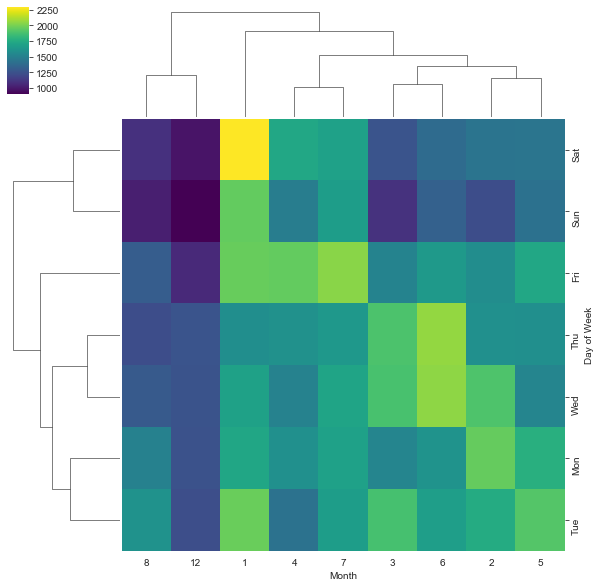


```python
# plt.figure(figsize=(12,6))
# sns.clustermap(dayMonth,cmap='viridis')
```

**Continue exploring the Data however you see fit!**
# Great Job!
